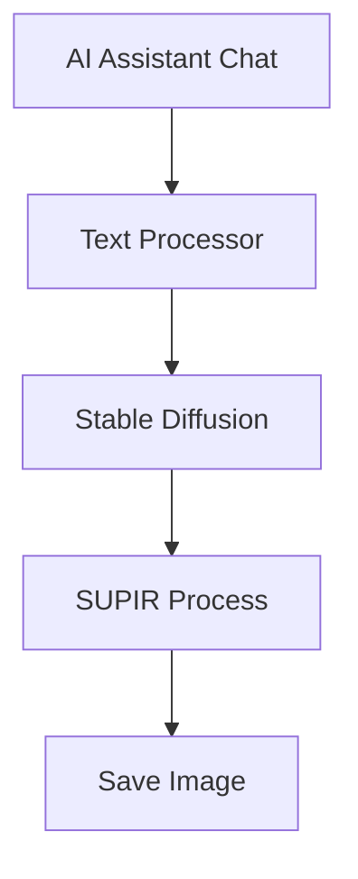
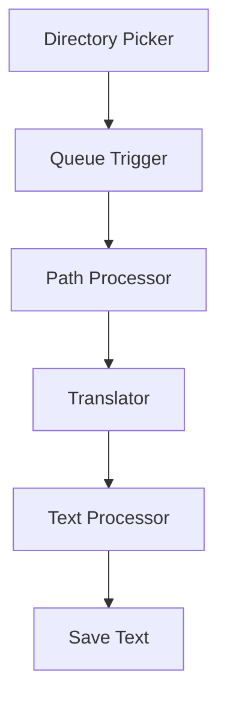
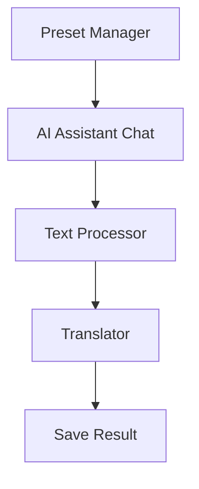
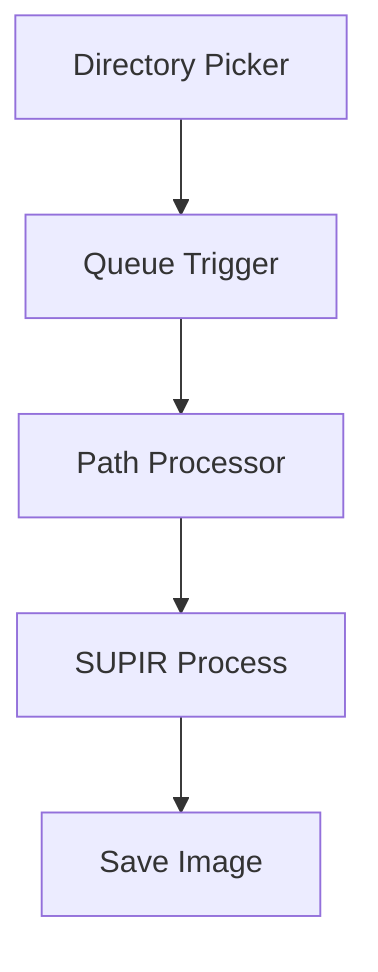
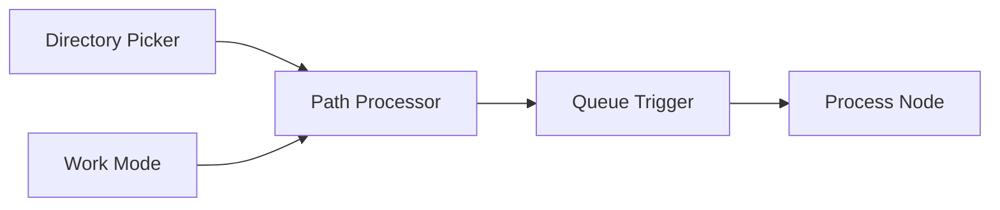

# Axun Nodes - ComfyUI 插件 v1.05

Axun Nodes 是一个用于ComfyUI的插件，提供AI助手、路径处理、队列触发、SUPIR超分和翻译功能。

## 项目结构说明

本项目采用以下目录结构进行代码组织:

```
axun_nodes/
├── nodes/                  # 节点实现目录
│   ├── AIAssistant/       # AI助手节点
│   │   ├── __init__.py      # 初始化文件
│   │   ├── AIAssistant.py   # AI助手节点实现
│   │   ├── preset_node.py   # 预设节点实现
│   │   ├── text_processor.py # 文本处理节点
│   │   └── utils/           # 工具函数目录
│   │       ├── api_handler.py  # API处理器
│   │       ├── image_utils.py  # 图像工具
│   │       ├── config_manager.py # 配置管理
│   │       └── __init__.py      # 初始化文件
│   ├── Qtools/            # 队列工具节点
│   │   ├── dir_picker.py    # 目录选择节点
│   │   ├── path_processor.py # 路径处理节点
│   │   ├── queue_trigger.py  # 队列触发节点
│   │   └── work_mode.py     # 工作模式节点
│   ├── Translator/        # 翻译功能节点
│   │   ├── translator_node.py # 翻译节点实现
│   │   ├── utils/            # 翻译工具
│   │   │   ├── translator_utils.py # 翻译工具函数
│   │   │   └── __init__.py
│   │   └── __init__.py
│   ├── Lotus/             # Lotus深度/法线预测节点
│   │   ├── lotus_nodes.py   # Lotus节点实现
│   │   └── __init__.py
│   └── Supir/             # SUPIR超分节点
│       ├── CKPT_PTH.py      # 模型路径配置
│       ├── configs/         # 配置文件目录
│       ├── options/         # 选项配置目录
│       ├── sgm/            # SGM模型核心
│       │   ├── models/     # 模型定义
│       │   │   ├── autoencoder.py  # 自编码器
│       │   │   ├── diffusion.py    # 扩散模型
│       │   │   └── __init__.py     # 初始化文件
│       │   ├── modules/    # 模块组件
│       │   │   ├── attention.py       # 注意力机制
│       │   │   ├── autoencoding/      # 自编码相关
│       │   │   │   ├── regularizers/  # 正则化器
│       │   │   │   ├── lpips/        # LPIPS损失
│       │   │   │   └── losses/       # 损失函数
│       │   │   ├── diffusionmodules/ # 扩散模块
│       │   │   │   ├── wrappers.py         # 包装器
│       │   │   │   ├── sigma_sampling.py   # 采样器
│       │   │   │   ├── util.py            # 工具函数
│       │   │   │   ├── sampling.py        # 采样实现
│       │   │   │   ├── sampling_utils.py  # 采样工具
│       │   │   │   ├── model.py          # 模型定义
│       │   │   │   ├── openaimodel.py    # OpenAI模型
│       │   │   │   ├── discretizer.py    # 离散化器
│       │   │   │   ├── guiders.py        # 引导器
│       │   │   │   ├── loss.py           # 损失函数
│       │   │   │   ├── denoiser_scaling.py    # 降噪缩放
│       │   │   │   ├── denoiser_weighting.py  # 降噪权重
│       │   │   │   ├── denoiser.py           # 降噪器
│       │   │   │   └── __init__.py           # 初始化文件
│       │   │   ├── distributions/  # 分布函数
│       │   │   │   └── distributions.py  # 分布实现
│       │   │   ├── ema.py            # 指数移动平均
│       │   │   ├── encoders/         # 编码器
│       │   │   │   └── modules.py    # 编码器模块
│       │   │   └── __init__.py
│       │   ├── util.py      # 工具函数
│       │   └── __init__.py
│       ├── supir_conditioner.py  # 条件控制器
│       ├── supir_decode.py       # 解码器
│       ├── supir_encode.py       # 编码器
│       ├── supir_first_stage.py  # 第一阶段
│       ├── supir_model_loader.py # 模型加载器
│       ├── supir_sample.py       # 采样器
│       └── __init__.py
├── web/                   # 前端代码目录
│   ├── AIAssistant.js     # AI助手功能
│   ├── AIAssistant_preset.js # AI助手预设功能
│   ├── text_processor.js   # 文本处理功能
│   ├── qtools.js          # 队列工具前端功能
│   └── translator.js      # 翻译功能
├── utils/                 # 工具函数目录
│   ├── api_handler.py     # API处理器
│   ├── config_utils.py    # 配置工具
│   ├── image_utils.py     # 图像处理工具
│   ├── route_handlers.py  # 路由处理器
│   ├── system_utils.py    # 系统工具
│   ├── web_utils.py       # Web工具
│   └── utils.py           # 通用工具函数
├── config/                # 配置文件目录
│   ├── AIAssistant_presets.json # AI助手预设配置
│   ├── AIAssistant_config.json  # AI助手配置
│   ├── dir_picker.json    # 目录选择器配置
│   ├── lotus_nodes.json   # Lotus节点配置
│   ├── translator.json    # 翻译API配置
│   └── empty_text_embed.pt # 空文本嵌入模型
├── icon/                  # 图标资源目录
├── __init__.py           # 插件初始化和节点注册
├── pyproject.toml        # 项目配置文件
└── requirements.txt      # 依赖包列表
```

### 模块分析

1. **AI助手模块**
   - AIAssistant: 提供AI对话功能,支持多种预设角色
   - PresetNode: 管理和应用预设配置
   - TextProcessor: 文本处理节点,支持文本拼接、计数和格式化

2. **队列工具模块**
   - QueueTrigger: 队列触发器,控制工作流执行顺序
   - PathProcessor: 路径处理工具,支持文件路径操作
   - DirPicker: 目录选择器,用于选择和管理工作目录
   - WorkMode: 工作模式控制器,切换不同的处理模式

3. **翻译模块**
   - Translator: 支持多语言翻译功能
   - TranslatorUtils: 翻译相关的工具函数

4. **SUPIR超分模块**
   - 基于SGM的高质量图像超分辨率处理
   - 支持多种超分倍率和处理模式
   - 包含完整的编码、采样和解码流程

## 功能节点说明

### AI助手节点
1. **AI Assistant Chat**: AI对话节点
   - 输入: 用户消息、系统提示、历史记录
   - 输出: AI回复、完整对话历史
   - 功能: 支持连续对话、角色扮演、上下文记忆

2. **Preset Manager**: 预设管理节点
   - 输入: 预设名称、自定义参数
   - 输出: 预设配置、系统提示
   - 功能: 加载和管理预设配置

3. **Text Processor**: 文本处理节点
   - 输入: 
     - 文本内容 (sample_text)
     - 前置文本 (appstart_text)
     - 后置文本 (append_text)
     - 内容类型过滤 (content_type)
     - 前缀后缀 (prefix, suffix)
     - 文本索引 (text_index)
     - 角色预设 (character_a/b/c_preset)
   - 输出: 
     - 场景文本 (scene_text)
     - 故事文本 (story_text)
     - 当前索引 (current_index)
     - 最大场景数 (max_scene)
   - 功能: 
     - 支持通过 content_type 参数筛选特定内容 (如 "scene_*,story_*")
     - 自动递增文本索引，达到最大值后重置
     - 智能提取大括号内的内容，去除标识符
     - 根据场景角色自动筛选和添加相关角色信息
     - 支持文本拼接和格式化
     - 自动计算并输出最大场景编号

4. **Image Selector**: 图像选择器节点
   - 输入: 
     - 图像A (image_a)
     - 图像B (image_b)
   - 输出: 
     - 选中的图像 (image)
   - 功能: 
     - 当图像A有输入时，输出图像A
     - 当图像A无输入时，输出图像B
     - 自动处理图像连接状态
     - 适用于需要图像备选的场景

### 队列工具节点
1. **Queue Trigger**: 队列触发节点
   - 输入: 触发信号、队列配置
   - 输出: 执行状态、下一步触发
   - 功能: 控制工作流执行顺序

2. **Path Processor**: 路径处理节点
   - 输入: 文件路径、处理参数
   - 输出: 处理后的路径
   - 功能: 路径拼接、分割、格式化

3. **Directory Picker**: 目录选择节点
   - 输入: 基础路径、过滤条件
   - 输出: 选中的目录路径
   - 功能: 目录浏览和选择

4. **Work Mode**: 工作模式节点
   - 输入: 模式选择、参数配置
   - 输出: 模式状态
   - 功能: 切换不同工作模式

### 翻译节点
1. **Translator**: 翻译处理节点
   - 输入: 源文本、目标语言
   - 输出: 翻译结果
   - 功能: 多语言文本翻译

2. **Auto Translator Box**: 自动翻译文本框节点
   - 输入: 文本内容
   - 输出: 原文文本
   - 功能: 
     - 自动检测中英文并互译
     - 实时显示翻译结果
     - 支持多行文本输入
     - 翻译结果直接显示在节点内
     - 保持原文输出不变

### SUPIR超分节点
1. **SUPIR Process**: 超分处理节点
   - 输入: 源图像、放大倍率、处理参数
   - 输出: 超分结果
   - 功能: 高质量图像超分辨率处理

## 工作流示例

### 1. AI辅助图像生成工作流


### 2. 批量翻译处理工作流


### 3. 智能对话工作流


### 4. 图像超分工作流


### 5. 批量处理工作流


### 6. 翻译辅助工作流


### 工作流优化建议

1. **性能优化**
   - 合理设置批处理大小
   - 适当使用低内存模式
   - 注意资源释放

2. **稳定性优化**
   - 添加错误处理节点
   - 使用Queue Trigger控制流程
   - 定期保存中间结果

3. **交互优化**
   - 使用预设节点简化配置
   - 添加进度显示
   - 合理设置默认参数

## 安装
1. 将本插件目录放入ComfyUI的`custom_nodes`目录
2. 安装依赖：`pip install -r requirements.txt`
   - Python 3.10+
   - PyTorch 2.0+
   - xformers (可选，用于加速)
   - transformers
   - omegaconf
   - einops
   - requests
3. 确保已安装tkinter：
   - Windows: 通常已预装
   - macOS: `brew install python-tk`
   - Linux: `sudo apt install python3-tk`
4. 下载 SUPIR 模型（可选）：
   - 从 [Hugging Face](https://huggingface.co/camenduru/SUPIR) 下载模型文件
   - 将模型文件放置在 `ComfyUI/models/supir` 目录下
5. 下载 Lotus 模型（可选）：
   - 从 [Hugging Face](https://huggingface.co/Kijai/lotus-comfyui/tree/main) 下载模型文件
   - 将模型文件放置在 `ComfyUI/models/diffusion_models` 目录下
6. 配置 AI Assistant（必需）：
   - 编辑 `config/AIAssistant_config.json` 文件
   - 填入相应的API密钥和配置信息
7. 配置翻译功能（可选）：
   - 编辑 `config/translator.json` 文件
   - 填入百度翻译API密钥
8. 重启ComfyUI

## 使用技巧

### 1. 文本处理优化
- 使用 Text Processor 节点进行文本拼接时,可以设置自动计数功能
- 计数器支持自动递增、手动控制等多种模式
- 可以通过格式化功能统一文本输出格式
- 支持多个文本处理节点串联使用

### 2. 队列工具使用
- Path Processor 支持正则表达式和扩展名两种过滤方式
- 使用 Queue Trigger 可以精确控制工作流执行顺序
- Work Mode 节点可以快速切换批处理和单文件模式
- Directory Picker 支持保存常用目录路径

### 3. AI助手应用
- 使用预设管理器可以快速切换不同场景
- 支持连续对话,保持上下文连贯性
- 可以通过参数调整来控制输出的创造性
- 支持中英文混合输入和多轮对话

### 4. 翻译功能
- 双击文本框即可触发翻译
- 支持中英文自动识别和互译
- 翻译请求具有防抖功能,避免频繁API调用
- 可以配置自己的API密钥

### 5. SUPIR超分应用
- 支持多种超分倍率,可根据需求选择
- 提供不同的内存模式,平衡性能和显存占用
- 可以通过分块处理来支持大尺寸图像
- 支持批量处理多张图像

### 6. 性能优化建议
- 合理使用批处理模式提高效率
- 适当调整分块大小和重叠区域
- 根据显存大小选择合适的内存模式
- 使用队列工具实现断点续处理

## 更新日志

### v1.05 (2024-03-22)
- 新增 Image Selector 节点，支持图像选择和备选功能
- 优化 Text Processor 节点的文本处理功能
  - 新增 story_name 输出，支持中英文标题组合
  - 新增 story_cover 输出，支持封面提示词生成
  - 新增 story_summary 输出，支持中英文摘要
  - 新增 scene_index 和 story_index 输出
  - 优化 story_text 为 story_text_cn 和 story_text_en 双语输出
- 改进 Auto Translator Box 节点的翻译显示效果

### v1.04 (2024-03-21)
- 新增 Text Processor 节点,支持文本拼接和计数功能
- 优化 AI Assistant 节点的对话体验
- 改进 Queue Trigger 的计数器功能
- 更新依赖包版本,提高稳定性
- 修复已知bug

### v1.03 (2024-03-15)
- 新增 SUPIR 超分辨率处理功能
- 优化批处理模式的性能
- 改进文件路径处理逻辑
- 更新模型加载机制
- 修复内存泄漏问题

### v1.02 (2024-03-10)
- 新增翻译功能,支持中英互译
- 优化工作流触发机制
- 改进预设管理系统
- 更新用户界面交互
- 修复路径处理bug

### v1.01 (2024-03-05)
- 新增 AI Assistant 预设功能
- 优化队列工具性能
- 改进错误处理机制
- 更新配置文件结构
- 修复多线程问题

### v1.00 (2024-03-01)
- 首次发布
- 基础功能实现
- AI助手系统
- 队列工具
- 路径处理

## 贡献
欢迎提交Pull Request。对于重大更改，请先创建issue讨论。

## 许可证
[MIT](LICENSE)

---

# Axun Nodes - ComfyUI Plugin

[English version follows...]

[Previous English content remains unchanged]

