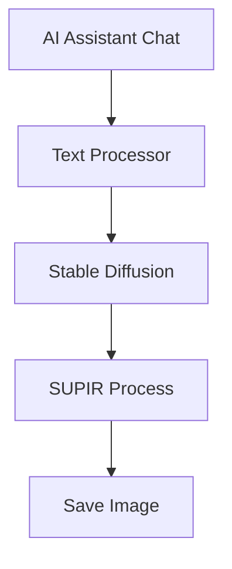
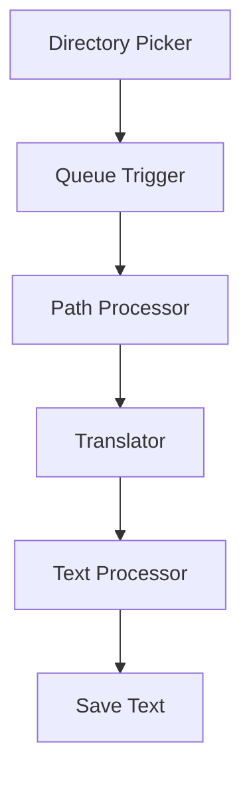
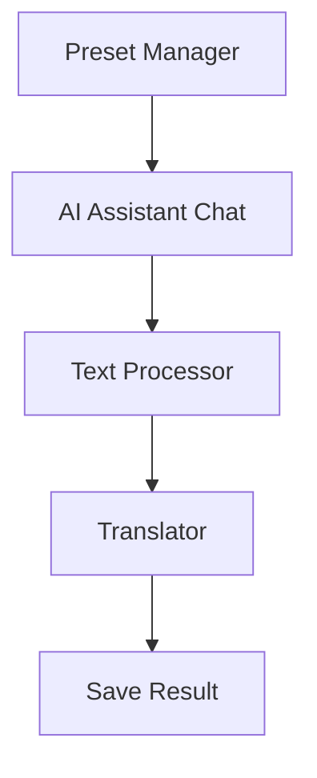
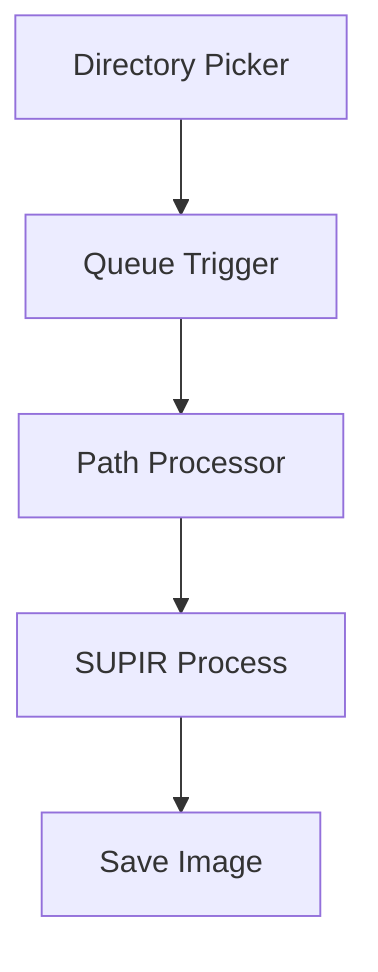
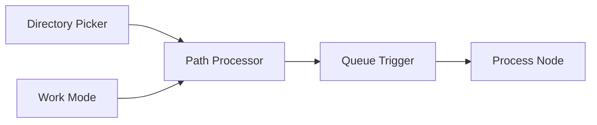

# Axun Nodes - ComfyUI 插件 v1.06

Axun Nodes 是一个用于ComfyUI的插件，提供AI助手、路径处理、队列触发、SUPIR超分和翻译功能。

## 项目结构说明

本项目采用以下目录结构进行代码组织:

```
axun_nodes/
├── nodes/                  # 节点实现目录
│   ├── AIAssistant/       # AI助手节点
│   │   ├── __init__.py      # 初始化文件
│   │   ├── AIAssistant.py   # AI助手节点实现
│   │   ├── preset_node.py   # 预设节点实现
│   │   ├── text_processor.py # 文本处理节点
│   │   ├── text_selector.py  # 文本选择器节点
│   │   ├── image_selector.py # 图像选择器节点
│   │   ├── text_cache.py    # 文本缓存节点
│   │   ├── number_generator.py # 数字生成器节点
│   │   └── utils/           # 工具函数目录
│   │       ├── api_handler.py  # API处理器
│   │       ├── image_utils.py  # 图像工具
│   │       ├── config_manager.py # 配置管理
│   │       └── __init__.py      # 初始化文件
│   ├── Qtools/            # 队列工具节点
│   │   ├── dir_picker.py    # 目录选择节点
│   │   ├── path_processor.py # 路径处理节点
│   │   ├── queue_trigger.py  # 队列触发节点
│   │   └── work_mode.py     # 工作模式节点
│   ├── Translator/        # 翻译功能节点
│   │   ├── auto_translator_box.py # 自动翻译文本框节点
│   │   ├── translator_node.py # 翻译节点实现
│   │   ├── utils/            # 翻译工具
│   │   │   ├── translator_utils.py # 翻译工具函数
│   │   │   └── __init__.py
│   │   └── __init__.py
│   ├── Lotus/             # Lotus深度/法线预测节点
│   │   ├── lotus_nodes.py   # Lotus节点实现
│   │   └── __init__.py
│   └── Supir/             # SUPIR超分节点
│       ├── CKPT_PTH.py      # 模型路径配置
│       ├── configs/         # 配置文件目录
│       ├── options/         # 选项配置目录
│       ├── sgm/            # SGM模型核心
│       │   ├── models/     # 模型定义
│       │   │   ├── autoencoder.py  # 自编码器
│       │   │   ├── diffusion.py    # 扩散模型
│       │   │   └── __init__.py     # 初始化文件
│       │   ├── modules/    # 模块组件
│       │   │   ├── attention.py       # 注意力机制
│       │   │   ├── autoencoding/      # 自编码相关
│       │   │   │   ├── regularizers/  # 正则化器
│       │   │   │   ├── lpips/        # LPIPS损失
│       │   │   │   └── losses/       # 损失函数
│       │   │   ├── diffusionmodules/ # 扩散模块
│       │   │   │   ├── wrappers.py         # 包装器
│       │   │   │   ├── sigma_sampling.py   # 采样器
│       │   │   │   ├── util.py            # 工具函数
│       │   │   │   ├── sampling.py        # 采样实现
│       │   │   │   ├── sampling_utils.py  # 采样工具
│       │   │   │   ├── model.py          # 模型定义
│       │   │   │   ├── openaimodel.py    # OpenAI模型
│       │   │   │   ├── discretizer.py    # 离散化器
│       │   │   │   ├── guiders.py        # 引导器
│       │   │   │   ├── loss.py           # 损失函数
│       │   │   │   ├── denoiser_scaling.py    # 降噪缩放
│       │   │   │   ├── denoiser_weighting.py  # 降噪权重
│       │   │   │   ├── denoiser.py           # 降噪器
│       │   │   │   └── __init__.py           # 初始化文件
│       │   │   ├── distributions/  # 分布函数
│       │   │   │   └── distributions.py  # 分布实现
│       │   │   ├── ema.py            # 指数移动平均
│       │   │   ├── encoders/         # 编码器
│       │   │   │   └── modules.py    # 编码器模块
│       │   │   └── __init__.py
│       │   ├── util.py      # 工具函数
│       │   └── __init__.py
│       ├── supir_conditioner.py  # 条件控制器
│       ├── supir_decode.py       # 解码器
│       ├── supir_encode.py       # 编码器
│       ├── supir_first_stage.py  # 第一阶段
│       ├── supir_model_loader.py # 模型加载器
│       ├── supir_sample.py       # 采样器
│       └── __init__.py
├── web/                   # 前端代码目录
│   ├── AIAssistant.js     # AI助手功能
│   ├── AIAssistant_preset.js # AI助手预设功能
│   ├── text_processor.js   # 文本处理功能
│   ├── qtools.js          # 队列工具前端功能
│   └── translator.js      # 翻译功能
├── utils/                 # 工具函数目录
│   ├── api_handler.py     # API处理器
│   ├── config_utils.py    # 配置工具
│   ├── image_utils.py     # 图像处理工具
│   ├── route_handlers.py  # 路由处理器
│   ├── system_utils.py    # 系统工具
│   ├── web_utils.py       # Web工具
│   └── utils.py           # 通用工具函数
├── config/                # 配置文件目录
│   ├── AIAssistant_presets.json # AI助手预设配置
│   ├── AIAssistant_config.json  # AI助手配置
│   ├── dir_picker.json    # 目录选择器配置
│   ├── lotus_nodes.json   # Lotus节点配置
│   ├── translator.json    # 翻译API配置
│   └── empty_text_embed.pt # 空文本嵌入模型
├── icon/                  # 图标资源目录
├── __init__.py           # 插件初始化和节点注册
├── pyproject.toml        # 项目配置文件
└── requirements.txt      # 依赖包列表
```

### 模块分析

1. **AI助手模块**
   - AIAssistant: 提供AI对话功能，支持多种预设角色
   - PresetNode: 管理和应用预设配置
   - TextProcessor: 文本处理节点，支持文本拼接、计数和格式化
   - TextSelector: 文本选择器，支持多输入优先级选择
   - ImageSelector: 图像选择器，支持多图像优先级选择
   - TextCache: 文本缓存管理，支持临时存储和清除
   - NumberGenerator: 数字生成器，支持自定义范围和格式

2. **队列工具模块**
   - QueueTrigger: 队列触发器，控制工作流执行顺序
   - PathProcessor: 路径处理工具，支持文件路径操作
   - DirPicker: 目录选择器，用于选择和管理工作目录
   - Directory Opener: 目录打开器，用于一键打开指定目录
   - WorkMode: 工作模式控制器，切换不同的处理模式

3. **翻译模块**
   - AutoTranslatorBox: 自动翻译文本框，支持实时翻译显示
   - Translator: 支持多语言翻译功能
   - TranslatorUtils: 翻译相关的工具函数

4. **SUPIR超分模块**
   - 基于SGM的高质量图像超分辨率处理
   - 支持多种超分倍率和处理模式
   - 包含完整的编码、采样和解码流程

## 功能节点说明

### AI助手节点组

#### Text Processor 节点 (📝)
- 功能：AI辅助文本处理和生成
- 输入：
  - system_prompt: 系统提示词
  - user_prompt: 用户提示词
  - sample_character: 角色示例
  - style_preset: 风格预设
  - scene_preset: 场景预设
  - shot_preset: 镜头预设
- 输出：
  - story_cover: 封面描述
  - story_summary: 故事概要
  - scene_text: 场景文本
- 说明：支持中英双语输出，自动优化格式

#### Text Selector 节点 (🔀)
- 功能：按优先级选择输入文本
- 输入：
  - text1: 最高优先级文本
  - text2: 次优先级文本
  - text3: 第三优先级文本
  - text4: 最低优先级文本
- 输出：
  - selected_text: 选中的文本
- 说明：按优先级顺序选择非空文本输入

#### Image Selector 节点 (🔄)
- 功能：按优先级选择输入图像
- 输入：
  - image_a: 最高优先级图像
  - image_b: 次优先级图像
  - image_c: 最低优先级图像
- 输出：
  - image: 选中的图像
- 说明：按优先级顺序选择有效图像输入

#### Text Cache 节点 (📋)
- 功能：文本内容缓存管理
- 输入：
  - text: 待缓存文本
  - clear: 清除触发器
- 输出：
  - text: 缓存文本
- 说明：支持文本暂存和清除操作

#### Number Generator 节点 (🔢)
- 功能：生成自定义格式的数字
- 输入：
  - start: 起始数字
  - end: 结束数字
  - step: 步长
  - format: 输出格式
- 输出：
  - number: 生成的数字
- 说明：支持自定义范围和格式的数字生成

#### AI Assistant Preset 节点 (⚙️)
- 功能：AI助手预设管理
- 特性：
  - 系统预设：基础行为定义
  - 风格预设：文风样式定义
  - 场景预设：场景描述模板
  - 镜头预设：视角描述模板
  - 角色预设：人物特征定义
  - 图片预览：
    - 支持所有预设类型的图片预览
    - 鼠标悬停实时显示
    - 本地化图片管理
    - 自动图片命名和复制
    - 支持多种图片格式
  - 预设管理：
    - 支持预设的导入导出
    - 实时预览和编辑
    - 多语言支持
- 说明：
  - 预设图片存储在项目根目录的image目录下
  - 图片命名与预设名称一致
  - 支持jpg、png等常见图片格式
  - 编辑预设时可选择和预览图片

#### Story Extractor 节点 (📖)
- 功能：提取中文故事内容
- 输入：
  - sample_story: 原始故事文本（包含中英文和格式信息）
- 显示：
  - extracted_text: 提取的中文内容（包括标题、简介和章节内容）
- 说明：
  - 自动提取故事标题和简介
  - 按章节顺序整理内容
  - 支持多章节故事提取
  - 实时显示提取结果

### Translator 节点组

#### Auto Translator Box 节点 (🌐)
- 功能：自动文本翻译
- 特性：
  - 支持多种翻译服务
  - 批量翻译能力
  - 自动语言检测
  - 翻译缓存机制
  - 节点内实时显示
- 说明：适用于大规模文本翻译

### 队列工具节点
1. **Queue Trigger**: 队列触发节点
   - 输入: 触发信号、队列配置
   - 输出: 执行状态、下一步触发
   - 功能: 控制工作流执行顺序

2. **Path Processor**: 路径处理节点
   - 输入: 文件路径、处理参数
   - 输出: 处理后的路径
   - 功能: 路径拼接、分割、格式化

3. **Directory Picker**: 目录选择节点
   - 输入: 基础路径、过滤条件
   - 输出: 选中的目录路径
   - 功能: 目录浏览和选择

4. **Directory Opener**: 目录打开器节点
   - 输入: 
     - character_dir: 角色目录路径
     - story_dir: 故事目录路径
     - cover_dir: 封面目录路径
     - animation_dir: 动画目录路径
     - other_dir: 其他目录路径
   - 功能: 
     - 一键打开指定目录
     - 支持多个目录同时管理
     - 自动验证目录有效性
     - 跨平台支持(Windows/macOS/Linux)
   - 特性：
     - 一键打开指定目录
     - 支持多个目录同时管理
     - 自动验证目录有效性
     - 跨平台支持(Windows/macOS/Linux)
     - 优化的用户交互体验
   - 说明：
     - 支持拖放操作
     - 实时目录验证
     - 错误提示反馈
     - 自动路径格式转换

5. **Work Mode**: 工作模式节点
   - 输入: 模式选择、参数配置
   - 输出: 模式状态
   - 功能: 切换不同工作模式

### 翻译节点
1. **Translator**: 翻译处理节点
   - 输入: 源文本、目标语言
   - 输出: 翻译结果
   - 功能: 多语言文本翻译

2. **Auto Translator Box**: 自动翻译文本框节点
   - 输入: 文本内容
   - 输出: 原文文本
   - 功能: 
     - 自动检测中英文并互译
     - 实时显示翻译结果
     - 支持多行文本输入
     - 翻译结果直接显示在节点内
     - 保持原文输出不变

### SUPIR超分节点
1. **SUPIR Process**: 超分处理节点
   - 输入: 源图像、放大倍率、处理参数
   - 输出: 超分结果
   - 功能: 高质量图像超分辨率处理

## 工作流示例

### 1. AI辅助图像生成工作流


### 2. 批量翻译处理工作流


### 3. 智能对话工作流


### 4. 图像超分工作流


### 5. 批量处理工作流


### 6. 翻译辅助工作流


### 工作流优化建议

1. **性能优化**
   - 合理设置批处理大小
   - 适当使用低内存模式
   - 注意资源释放

2. **稳定性优化**
   - 添加错误处理节点
   - 使用Queue Trigger控制流程
   - 定期保存中间结果

3. **交互优化**
   - 使用预设节点简化配置
   - 添加进度显示
   - 合理设置默认参数

## 安装说明

1. 克隆仓库到 ComfyUI 的 custom_nodes 目录
```bash
cd custom_nodes
git clone https://github.com/yourusername/axun_nodes.git
```

2. 安装依赖
```bash
pip install -r requirements.txt
```

3. 重启 ComfyUI

## 使用说明

1. 在节点菜单中查找对应的节点组：
   - !Axun Nodes/AIAssistant
   - !Axun Nodes/Translator
   - !Axun Nodes/Qtools

2. 根据需要选择并添加节点到工作流

3. 按照节点说明配置参数

4. 运行工作流

## 注意事项

1. 确保 ComfyUI 版本兼容（推荐使用最新版本）
2. 部分节点可能需要额外的API密钥或服务配置
3. 使用前请阅读节点说明和示例工作流
4. 定期更新插件以获取最新功能和修复

## 贡献指南

1. 欢迎提交 Issue 和 Pull Request
2. 代码提交请遵循项目编码规范
3. 新功能请提供完整的文档和示例

## 许可证

MIT License

## 更新日志

详细更新历史请查看 [CHANGELOG.md](CHANGELOG.md)

