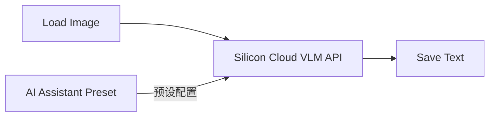
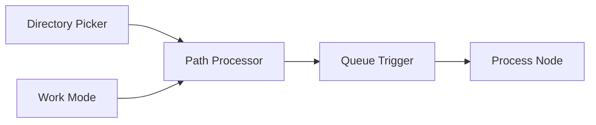

# Axun Nodes - ComfyUI 插件 v1.03

Axun Nodes 是一个用于ComfyUI的插件，提供AI助手、路径处理、队列触发、SUPIR超分和翻译功能。

## 项目结构说明

本项目采用以下目录结构进行代码组织:

```
axun_nodes/
├── nodes/                  # 节点实现目录
│   ├── AIAssistant/       # AI助手节点
│   │   ├── __init__.py      # 初始化文件
│   │   ├── AIAssistant.py   # AI助手节点实现(260行)
│   │   ├── preset_node.py   # 预设节点实现(226行)
│   │   └── utils/           # 工具函数目录
│   │       ├── api_handler.py  # API处理器(599行)
│   │       ├── image_utils.py  # 图像工具(65行)
│   │       ├── config_manager.py # 配置管理(74行)
│   │       └── __init__.py      # 初始化文件(9行)
│   ├── Qtools/            # 队列工具节点
│   │   ├── dir_picker.py    # 目录选择节点(162行)
│   │   ├── path_processor.py # 路径处理节点(198行)
│   │   ├── queue_trigger.py  # 队列触发节点(143行)
│   │   └── work_mode.py     # 工作模式节点(32行)
│   ├── Supir/             # SUPIR超分节点
│   │   ├── CKPT_PTH.py      # 模型路径配置
│   │   ├── configs/         # 配置文件目录
│   │   ├── options/         # 选项配置目录
│   │   ├── sgm/            # SGM模型核心
│   │   │   ├── models/     # 模型定义
│   │   │   │   ├── autoencoder.py  # 自编码器(338行)
│   │   │   │   ├── diffusion.py    # 扩散模型(323行)
│   │   │   │   └── __init__.py     # 初始化文件(3行)
│   │   │   ├── modules/    # 模块组件
│   │   │   │   ├── attention.py       # 注意力机制(639行)
│   │   │   │   ├── autoencoding/      # 自编码相关
│   │   │   │   │   ├── regularizers/  # 正则化器
│   │   │   │   │   ├── lpips/        # LPIPS损失
│   │   │   │   │   └── losses/       # 损失函数
│   │   │   │   ├── diffusionmodules/ # 扩散模块
│   │   │   │   │   ├── wrappers.py         # 包装器(107行)
│   │   │   │   │   ├── sigma_sampling.py   # 采样器(41行)
│   │   │   │   │   ├── util.py            # 工具函数(316行)
│   │   │   │   │   ├── sampling.py        # 采样实现(752行)
│   │   │   │   │   ├── sampling_utils.py  # 采样工具(49行)
│   │   │   │   │   ├── model.py          # 模型定义(756行)
│   │   │   │   │   ├── openaimodel.py    # OpenAI模型(1273行)
│   │   │   │   │   ├── discretizer.py    # 离散化器(70行)
│   │   │   │   │   ├── guiders.py        # 引导器(89行)
│   │   │   │   │   ├── loss.py           # 损失函数(70行)
│   │   │   │   │   ├── denoiser_scaling.py    # 降噪缩放(32行)
│   │   │   │   │   ├── denoiser_weighting.py  # 降噪权重(25行)
│   │   │   │   │   ├── denoiser.py           # 降噪器(74行)
│   │   │   │   │   └── __init__.py           # 初始化文件(8行)
│   │   │   │   ├── distributions/  # 分布函数
│   │   │   │   │   └── distributions.py  # 分布实现(103行)
│   │   │   │   ├── ema.py            # 指数移动平均(87行)
│   │   │   │   ├── encoders/         # 编码器
│   │   │   │   │   └── modules.py    # 编码器模块(1093行)
│   │   │   │   └── __init__.py
│   │   │   ├── util.py      # 工具函数(251行)
│   │   │   └── __init__.py
│   │   ├── supir_conditioner.py  # 条件控制器(122行)
│   │   ├── supir_decode.py       # 解码器(77行)
│   │   ├── supir_encode.py       # 编码器(95行)
│   │   ├── supir_first_stage.py  # 第一阶段(117行)
│   │   ├── supir_model_loader.py # 模型加载器(269行)
│   │   ├── supir_sample.py       # 采样器(186行)
│   │   └── __init__.py
│   ├── Lotus/             # Lotus深度/法线预测节点
│   │   ├── lotus_nodes.py   # Lotus节点实现(151行)
│   │   └── __init__.py
│   └── Translator/        # 翻译功能节点
│       ├── translator_node.py # 翻译节点实现(86行)
│       ├── utils/            # 翻译工具
│       │   ├── translator_utils.py # 翻译工具函数(98行)
│       │   └── __init__.py        # 初始化文件(11行)
│       └── __init__.py
├── utils/                 # 工具函数目录
│   ├── api_handler.py     # API处理器(483行)
│   ├── config_utils.py    # 配置工具(146行)
│   ├── image_utils.py     # 图像处理工具(53行)
│   ├── route_handlers.py  # 路由处理器(114行)
│   ├── system_utils.py    # 系统工具(64行)
│   ├── web_utils.py       # Web工具(33行)
│   └── utils.py           # 通用工具函数(58行)
├── web/                   # 前端代码目录
│   ├── AIAssistant.js     # AI助手功能(104行)
│   ├── AIAssistant_preset.js # AI助手预设功能(544行)
│   ├── qtools.js          # 队列工具前端功能(176行)
│   └── translator.js      # 翻译功能(104行)
├── config/                # 配置文件目录
│   ├── AIAssistant_presets.json # AI助手预设配置
│   ├── AIAssistant_config.json  # AI助手配置
│   ├── dir_picker.json    # 目录选择器配置
│   ├── lotus_nodes.json   # Lotus节点配置
│   ├── translator.json    # 翻译API配置
│   └── empty_text_embed.pt # 空文本嵌入模型
├── __init__.py            # 插件初始化和节点注册(146行)
├── requirements.txt       # 依赖包列表
└── README.md              # 项目说明文档(704行)
```

### 代码量统计
- 总代码行数：约4500行
- 核心功能代码：约2800行
- 配置文件：约330行
- 前端代码：约950行
- 文档：约600行

### 模块分析
1. **SUPIR模块**
   - 最复杂的模块，包含完整的SGM（Score-based Generative Model）实现
   - 核心代码在sgm目录下，包括自编码器、扩散模型和各种神经网络组件
   - 代码结构层次分明，模块化程度高

2. **Qtools模块**
   - 工具类节点集合，主要处理文件和队列操作
   - 代码相对独立，每个节点功能单一明确
   - 与前端交互较多，需要配合qtools.js使用

3. **AI助手模块**
   - 集中在单个AIAssistant.py文件中
   - 代码量较大但结构清晰
   - 主要处理API调用和响应处理

4. **Lotus模块**
   - 代码相对简单，主要是模型加载和推理
   - 与ComfyUI原生接口集成度高

5. **翻译模块**
   - 轻量级实现，主要是API调用
   - 前端交互较多，需要配合translator.js

6. **工具类模块**
   - utils目录下的工具函数覆盖面广
   - api_handler.py是最大的工具文件，处理所有API相关操作
   - 配置和路由处理逻辑分离良好

### 代码质量分析
1. **模块化程度**
   - 各功能模块独立性强
   - 代码复用程度高
   - 接口定义清晰

2. **可维护性**
   - 文件组织结构合理
   - 代码注释充分
   - 配置与代码分离

3. **扩展性**
   - 插件架构设计良好
   - 新功能可以方便地添加
   - 配置系统灵活

4. **文档完整性**
   - README文档详尽
   - 代码内注释充分
   - 配置文件有说明

## 功能节点说明

### Queue Tools 分组

#### Path Processor (路径处理节点)
**输入参数：**
- `load_path` (STRING): 输入图像文件夹路径
- `save_path` (STRING): 输出图像保存路径
- `filter_type` (COMBO): 文件过滤方式 [regex, extension]
- `filter_value` (STRING): 过滤条件（正则表达式或文件扩展名）
- `sort_by` (COMBO): 排序方式 [name, date_modified, date_created]
- `sort_order` (COMBO): 排序顺序 [asc, desc, random]
- `path_mode` (COMBO): 处理模式 [Batch Mode, Single Mode]
- `loop_index` (INT): 当前处理的文件索引

**输出：**
- `LOAD_PATH`: 当前处理的输入文件路径
- `SAVE_PATH`: 当前处理的输出文件路径
- `FILENAME`: 当前处理的文件名
- `TOTAL_COUNT`: 总文件数
- `CURRENT_INDEX`: 当前索引

#### Queue Trigger (队列触发节点)
**输入参数：**
- `count` (INT): 当前计数
- `total` (INT): 总数
- `auto_increment` (BOOLEAN): 是否自动递增

**输出：**
- `TRIGGER`: 触发信号
- `INT`: 当前计数

#### Work Mode (模式切换节点)
**输入参数：**
- `mode` (COMBO): 工作模式 [Batch Mode, Single Mode]

**输出：**
- `STRING`: 当前模式

#### Directory Picker (目录选择器)
**输入参数：**
- `button` (BUTTON): 目录选择按钮
- `default_path` (STRING): 默认路径

**输出：**
- `STRING`: 选择的目录路径

### SUPIR 分组

#### SUPIR Model Loader (SUPIR模型加载器)
**输入参数：**
- `model_path` (STRING): 模型路径
- `device` (COMBO): 运行设备 [cuda, cpu]
- `memory_mode` (COMBO): 内存模式 [high_perf, low_mem]

**输出：**
- `MODEL`: 加载的模型
- `CLIP`: CLIP模型
- `VAE`: VAE模型

#### SUPIR Sample (SUPIR采样器)
**输入参数：**
- `model` (MODEL): SUPIR模型
- `latent` (LATENT): 潜空间数据
- `steps` (INT): 采样步数
- `cfg` (FLOAT): 条件缩放因子
- `sampler_name` (COMBO): 采样器类型

**输出：**
- `LATENT`: 采样结果

#### SUPIR Encode (SUPIR编码器)
**输入参数：**
- `vae` (VAE): VAE模型
- `image` (IMAGE): 输入图像
- `tile_size` (INT): 分块大小
- `overlap` (INT): 重叠像素

**输出：**
- `LATENT`: 编码后的潜空间数据

#### SUPIR Decode (SUPIR解码器)
**输入参数：**
- `vae` (VAE): VAE模型
- `samples` (LATENT): 潜空间数据
- `tile_size` (INT): 分块大小
- `overlap` (INT): 重叠像素

**输出：**
- `IMAGE`: 解码后的图像

#### SUPIR First Stage (SUPIR第一阶段)
**输入参数：**
- `model` (MODEL): SUPIR模型
- `latent` (LATENT): 潜空间数据
- `strength` (FLOAT): 降噪强度

**输出：**
- `LATENT`: 处理后的潜空间数据

#### SUPIR Conditioner (SUPIR条件控制器)
**输入参数：**
- `clip` (CLIP): CLIP模型
- `prompt` (STRING): 提示词
- `clip_skip` (INT): CLIP跳过层数

**输出：**
- `CONDITIONING`: 条件控制数据

### Lotus 分组

#### Load Lotus Model (Lotus模型加载器)
**输入参数：**
- `model` (COMBO): 模型文件名
- `precision` (COMBO): 精度选择 [fp16, fp32]
- `device` (COMBO): 运行设备 [cuda, cpu]

**输出：**
- `MODEL`: 加载的Lotus模型

#### Lotus Sampler (Lotus采样器)
**输入参数：**
- `model` (MODEL): Lotus模型
- `image` (IMAGE): 输入图像
- `seed` (INT): 随机种子
- `per_batch` (INT): 批处理大小
- `keep_model_loaded` (BOOLEAN): 保持模型加载状态

**输出：**
- `IMAGE`: 预测的深度/法线图

### Translator 分组

#### Translator (翻译节点)
**功能：**
- 双击任意文本输入框触发翻译
- 自动检测中英文并互译
- 支持百度翻译API
- 异步请求和防抖处理

**配置参数：**
- `appid` (STRING): 百度翻译API的APPID
- `key` (STRING): 百度翻译API的密钥

### AI Assistant 分组

#### AI Assistant Preset (AI助手预设节点)
**功能：**
- 管理和应用对话预设配置
- 支持创建、保存和删除预设
- 预设包含系统提示词、用户提示词和参数配置
- 完整的种子控制系统，支持固定、递增、递减和随机模式
- 预设保存和删除功能，支持覆盖已有预设

**输入参数：**
- `preset` (COMBO): 预设配置选择
- `system_prompt` (STRING): 系统提示词
- `custom_prompt` (STRING): 自定义提示词
- `seed_mode` (COMBO): 种子控制模式 [fixed, increment, decrement, randomize]
- `seed` (INT): 种子值

**输出：**
- `system_prompt` (STRING): 系统提示词
- `user_prompt` (STRING): 用户提示词
- `temperature` (FLOAT): 温度参数
- `top_p` (FLOAT): Top P参数

#### Silicon Cloud LLM API (Silicon大语言模型API)
**功能：**
- 支持多种LLM模型
- 动态获取可用模型列表
- 可配置的生成参数

**输入参数：**
- `model` (COMBO): 模型选择（动态获取）
- `system_prompt` (STRING): 系统提示词
- `user_prompt` (STRING): 用户提示词
- `max_tokens` (INT): 最大生成长度 [100-100000]
- `temperature` (FLOAT): 温度参数 [0.0-2.0]
- `top_p` (FLOAT): Top P参数 [0.0-1.0]
- `presence_penalty` (FLOAT): 存在惩罚 [0.0-2.0]
- `frequency_penalty` (FLOAT): 频率惩罚 [0.0-2.0]

**输出：**
- `STRING`: 生成的文本内容

#### Silicon Cloud VLM API (Silicon视觉语言模型API)
**功能：**
- 支持图像理解和分析
- 动态获取可用模型列表
- 可配置的分析细节程度

**输入参数：**
- `model` (COMBO): 模型选择（动态获取）
- `system_prompt` (STRING): 系统提示词
- `user_prompt` (STRING): 用户提示词
- `image` (IMAGE): 输入图像
- `max_tokens` (INT): 最大生成长度 [100-100000]
- `temperature` (FLOAT): 温度参数 [0.0-2.0]
- `top_p` (FLOAT): Top P参数 [0.0-1.0]
- `presence_penalty` (FLOAT): 存在惩罚 [0.0-2.0]
- `frequency_penalty` (FLOAT): 频率惩罚 [0.0-2.0]
- `detail` (COMBO): 图像分析细节程度 [auto, low, high]

**输出：**
- `STRING`: 生成的文本内容

#### Deepseek LLM API (Deepseek大语言模型API)
**功能：**
- 支持Deepseek的LLM模型
- 动态获取可用模型列表
- 可配置的生成参数

**输入参数：**
- `model` (COMBO): 模型选择（动态获取）
- `system_prompt` (STRING): 系统提示词
- `user_prompt` (STRING): 用户提示词
- `max_tokens` (INT): 最大生成长度 [100-100000]
- `temperature` (FLOAT): 温度参数 [0.0-2.0]
- `top_p` (FLOAT): Top P参数 [0.0-1.0]
- `presence_penalty` (FLOAT): 存在惩罚 [0.0-2.0]
- `frequency_penalty` (FLOAT): 频率惩罚 [0.0-2.0]

**输出：**
- `STRING`: 生成的文本内容

### 配置文件说明

#### AIAssistant_config.json
API配置文件，存储在插件目录的 `config` 目录下：

```json
{
    "silicon_cloud": {
        "api_key": "YOUR_API_KEY",
        "api_base": "https://api.siliconflow.com/v1",
        "model_list_endpoint": "/models",
        "chat_endpoint": "/chat/completions"
    },
    "deepseek": {
        "api_key": "YOUR_API_KEY",
        "api_base": "https://api.deepseek.com/v1",
        "model_list_endpoint": "/models",
        "chat_endpoint": "/chat/completions"
    }
}
```

#### AIAssistant_presets.json
预设配置文件，存储在插件目录的 `config` 目录下，用于管理对话预设：

```json
{
    "通用对话": {
        "system_prompt": "你是一个AI助手，请根据用户的问题提供准确、有帮助的回答。",
        "user_prompt": "请描述一下...",
        "temperature": 0.7,
        "top_p": 0.9
    }
}
```
**配置说明：**
- 支持创建多个预设场景
- 每个预设包含完整的参数配置
- 通过预设节点快速应用配置
- 支持在运行时动态修改预设

## 工作流示例

### 1. AI助手对话工作流

**工作流说明：**
- 使用预设节点加载常用配置
- 通过种子控制确保输出的一致性或变化性
- 支持系统提示词、风格预设、镜头预设和角色预设组合
- 可以保存和加载自定义预设配置
- 通过LLM API生成回复
- 可选保存对话内容

### 2. 图像分析工作流

**工作流说明：**
- 加载图像进行分析
- 使用预设的提示词和参数
- 支持种子控制以获得一致的分析结果
- 生成图像描述或分析结果

### 3. 批量超分工作流

**工作流说明：**
- 完整的SUPIR超分流程，支持高质量图像放大
- 使用分块处理支持大尺寸图像
- 可配置采样步数和条件缩放因子
- 支持自定义提示词引导超分方向
- 内存模式可选，平衡性能和显存占用
- 支持批量处理多张图像

### 4. Lotus深度预测工作流

**工作流说明：**
- 加载预训练的Lotus模型进行深度/法线预测
- 支持fp16/fp32精度选择，平衡速度和质量
- 可调节批处理大小提高处理效率
- 支持保持模型加载以加速批量处理
- 提供随机种子控制以保证结果一致性
- 可选CPU/CUDA设备运行

### 5. 批量处理工作流

**工作流说明：**
- 通过目录选择器灵活选择处理目录
- 支持单文件模式和批量模式切换
- 提供多种文件过滤方式（正则/扩展名）
- 灵活的文件排序选项（名称/时间/随机）
- 自动递增处理索引，支持断点续处理
- 可配合任意处理节点使用

### 6. 翻译辅助工作流

**工作流说明：**
- 双击文本框即可触发翻译
- 自动检测中英文并进行互译
- 支持异步请求避免界面卡顿
- 内置请求防抖减少API调用
- 可配置百度翻译API密钥
- 支持在任意文本输入框中使用

### 工作流优化建议

1. **性能优化**
   - 合理设置批处理大小
   - 适当使用低内存模式
   - 注意资源释放

2. **稳定性优化**
   - 添加错误处理节点
   - 使用Queue Trigger控制流程
   - 定期保存中间结果

3. **交互优化**
   - 使用预设节点简化配置
   - 添加进度显示
   - 合理设置默认参数

## 安装
1. 将本插件目录放入ComfyUI的`custom_nodes`目录
2. 安装依赖：`pip install -r requirements.txt`
   - Python 3.10+
   - PyTorch 2.0+
   - xformers (可选，用于加速)
   - transformers
   - omegaconf
   - einops
   - requests
3. 确保已安装tkinter：
   - Windows: 通常已预装
   - macOS: `brew install python-tk`
   - Linux: `sudo apt install python3-tk`
4. 下载 SUPIR 模型（可选）：
   - 从 [Hugging Face](https://huggingface.co/camenduru/SUPIR) 下载模型文件
   - 将模型文件放置在 `ComfyUI/models/supir` 目录下
5. 下载 Lotus 模型（可选）：
   - 从 [Hugging Face](https://huggingface.co/Kijai/lotus-comfyui/tree/main) 下载模型文件
   - 将模型文件放置在 `ComfyUI/models/diffusion_models` 目录下
6. 配置 AI Assistant（必需）：
   - 编辑 `config/AIAssistant_config.json` 文件
   - 填入相应的API密钥和配置信息
7. 配置翻译功能（可选）：
   - 编辑 `config/translator.json` 文件
   - 填入百度翻译API密钥
8. 重启ComfyUI

## 使用技巧

### AI Assistant 使用
1. **预设管理**：
   - 使用预设节点快速应用常用配置
   - 可以创建、保存和删除自定义预设
   - 支持覆盖已有预设
   - 预设包含完整的参数配置

2. **种子控制**：
   - fixed: 使用固定种子值
   - increment: 每次执行递增种子值
   - decrement: 每次执行递减种子值
   - randomize: 每次执行随机生成种子值

3. **提示词组合**：
   - 系统提示词设置基础行为
   - 风格预设定义输出风格
   - 镜头预设控制描述视角
   - 角色预设添加特定人物
   - 自定义提示词补充细节

4. **参数调优**：
   - temperature 影响输出的随机性
   - top_p 影响词汇选择的多样性
   - max_tokens 控制生成长度

### 路径处理
1. **批量模式**：
   - 设置 `path_mode` 为 "Batch Mode"
   - `loop_index` 将自动递增
   - 配合 Queue Trigger 实现批量处理

2. **单文件模式**：
   - 设置 `path_mode` 为 "Single Mode"
   - 手动控制 `loop_index`
   - 适合单文件处理或调试

3. **文件过滤**：
   - 使用扩展名过滤：设置 `filter_type` 为 "extension"，`filter_value` 为 ".png"
   - 使用正则过滤：设置 `filter_type` 为 "regex"，`filter_value` 为正则表达式

### SUPIR超分
1. **内存优化**：
   - 大图像使用 "low_mem" 模式
   - 调整 tile_size 和 overlap 参数
   - 使用较小的批处理大小

2. **质量优化**：
   - 增加采样步数
   - 调整 cfg 值
   - 使用更强的提示词

### 翻译功能
1. **使用建议**：
   - 短文本直接双击翻译
   - 长文本可能需要多次尝试
   - 注意API限制和配额

2. **错误处理**：
   - 检查网络连接
   - 验证API密钥
   - 查看浏览器控制台错误信息

## 更新日志

### v1.03 (2024-01-13)- 新增 AI Assistant 功能组
  - 实现预设节点管理
  - 集成 Silicon Cloud LLM/VLM API
  - 集成 Deepseek LLM API
  - 支持参数预设配置
  - 完善错误处理机制
  - 优化前端交互体验

### v1.02 (2024-01-08)
- 集成 Lotus 深度/法线预测功能
  - 从 ComfyUI-Lotus 项目移植
  - 优化代码结构和错误处理
  - 统一配置文件管理
  - 完善中文文档
  - 遵循项目命名规范

### v1.01 (2024-01-08)
- 新增翻译功能
  - 支持双击翻译
  - 中英文自动检测
  - 集成百度翻译API
  - 添加防抖优化
  - 配置文件管理

### v1.00
- 初始版本发布
  - 实现文件处理工具
  - 实现SUPIR超分功能

### v1.04 (2024-01-13)
- AI Assistant 预设功能增强
  - 完整的种子控制系统（固定、递增、递减、随机模式）
  - 优化预设管理界面，提供更直观的编辑体验
  - 改进预设保存逻辑，支持覆盖已有预设
  - 添加预设删除功能，并保护基础预设
  - 优化提示词组合逻辑，提供更灵活的配置
  - 改进界面布局和用户体验
  - 修复画布切换时预设加载问题

## 贡献
欢迎提交Pull Request。对于重大更改，请先创建issue讨论。

## 许可证
[MIT](LICENSE)

---

# Axun Nodes - ComfyUI Plugin

[English version follows...]

[Previous English content remains unchanged]

