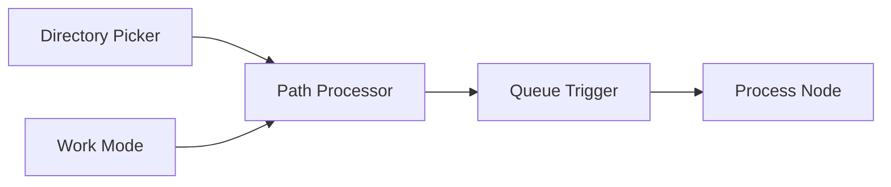

# Axun Nodes - ComfyUI 插件 v1.02

Axun Nodes 是一个用于ComfyUI的插件，提供路径处理、队列触发、SUPIR超分和翻译功能。

## 项目结构
```
axun_nodes/
├── nodes/               # 节点实现
│   ├── Qtools/         # 队列工具节点
│   │   ├── path_processor.py # 路径处理节点
│   │   ├── queue_trigger.py # 队列触发节点
│   │   ├── work_mode.py    # 工作模式节点
│   │   └── dir_picker.py   # 目录选择器节点
│   ├── Supir/          # SUPIR超分节点
│   │   ├── supir_sample.py      # 采样器节点
│   │   ├── supir_encode.py      # 编码器节点
│   │   ├── supir_decode.py      # 解码器节点
│   │   ├── supir_first_stage.py # 第一阶段处理节点
│   │   ├── supir_conditioner.py # 条件控制节点
│   │   └── supir_model_loader.py # 模型加载器
│   ├── Lotus/          # Lotus深度/法线预测节点
│   │   └── lotus_nodes.py # Lotus节点实现
│   └── Translator/     # 翻译功能节点
│       └── translator_node.py # 翻译节点
├── web/                 # 前端实现
│   └── js/
│       ├── web.js       # 前端交互脚本
│       └── translator.js # 翻译功能脚本
├── config/             # 配置文件目录
│   └── translator.json  # 翻译API配置
├── __init__.py         # 插件初始化和节点注册
└── README.md           # 项目说明文档
```

## 功能节点说明

### Queue Tools 分组

#### Path Processor (路径处理节点)
**输入参数：**
- `load_path` (STRING): 输入图像文件夹路径
- `save_path` (STRING): 输出图像保存路径
- `filter_type` (COMBO): 文件过滤方式 [regex, extension]
- `filter_value` (STRING): 过滤条件（正则表达式或文件扩展名）
- `sort_by` (COMBO): 排序方式 [name, date_modified, date_created]
- `sort_order` (COMBO): 排序顺序 [asc, desc, random]
- `path_mode` (COMBO): 处理模式 [Batch Mode, Single Mode]
- `loop_index` (INT): 当前处理的文件索引

**输出：**
- `LOAD_PATH`: 当前处理的输入文件路径
- `SAVE_PATH`: 当前处理的输出文件路径
- `FILENAME`: 当前处理的文件名
- `TOTAL_COUNT`: 总文件数
- `CURRENT_INDEX`: 当前索引

#### Queue Trigger (队列触发节点)
**输入参数：**
- `count` (INT): 当前计数
- `total` (INT): 总数
- `auto_increment` (BOOLEAN): 是否自动递增

**输出：**
- `TRIGGER`: 触发信号
- `INT`: 当前计数

#### Work Mode (模式切换节点)
**输入参数：**
- `mode` (COMBO): 工作模式 [Batch Mode, Single Mode]

**输出：**
- `STRING`: 当前模式

#### Directory Picker (目录选择器)
**输入参数：**
- `button` (BUTTON): 目录选择按钮
- `default_path` (STRING): 默认路径

**输出：**
- `STRING`: 选择的目录路径

### SUPIR 分组

#### SUPIR Model Loader (SUPIR模型加载器)
**输入参数：**
- `model_path` (STRING): 模型路径
- `device` (COMBO): 运行设备 [cuda, cpu]
- `memory_mode` (COMBO): 内存模式 [high_perf, low_mem]

**输出：**
- `MODEL`: 加载的模型
- `CLIP`: CLIP模型
- `VAE`: VAE模型

#### SUPIR Sample (SUPIR采样器)
**输入参数：**
- `model` (MODEL): SUPIR模型
- `latent` (LATENT): 潜空间数据
- `steps` (INT): 采样步数
- `cfg` (FLOAT): 条件缩放因子
- `sampler_name` (COMBO): 采样器类型

**输出：**
- `LATENT`: 采样结果

#### SUPIR Encode (SUPIR编码器)
**输入参数：**
- `vae` (VAE): VAE模型
- `image` (IMAGE): 输入图像
- `tile_size` (INT): 分块大小
- `overlap` (INT): 重叠像素

**输出：**
- `LATENT`: 编码后的潜空间数据

#### SUPIR Decode (SUPIR解码器)
**输入参数：**
- `vae` (VAE): VAE模型
- `samples` (LATENT): 潜空间数据
- `tile_size` (INT): 分块大小
- `overlap` (INT): 重叠像素

**输出：**
- `IMAGE`: 解码后的图像

#### SUPIR First Stage (SUPIR第一阶段)
**输入参数：**
- `model` (MODEL): SUPIR模型
- `latent` (LATENT): 潜空间数据
- `strength` (FLOAT): 降噪强度

**输出：**
- `LATENT`: 处理后的潜空间数据

#### SUPIR Conditioner (SUPIR条件控制器)
**输入参数：**
- `clip` (CLIP): CLIP模型
- `prompt` (STRING): 提示词
- `clip_skip` (INT): CLIP跳过层数

**输出：**
- `CONDITIONING`: 条件控制数据

### Lotus 分组

#### Load Lotus Model (Lotus模型加载器)
**输入参数：**
- `model` (COMBO): 模型文件名
- `precision` (COMBO): 精度选择 [fp16, fp32]
- `device` (COMBO): 运行设备 [cuda, cpu]

**输出：**
- `MODEL`: 加载的Lotus模型

#### Lotus Sampler (Lotus采样器)
**输入参数：**
- `model` (MODEL): Lotus模型
- `image` (IMAGE): 输入图像
- `seed` (INT): 随机种子
- `per_batch` (INT): 批处理大小
- `keep_model_loaded` (BOOLEAN): 保持模型加载状态

**输出：**
- `IMAGE`: 预测的深度/法线图

### Translator 分组

#### Translator (翻译节点)
**功能：**
- 双击任意文本输入框触发翻译
- 自动检测中英文并互译
- 支持百度翻译API
- 异步请求和防抖处理

**配置参数：**
- `appid` (STRING): 百度翻译API的APPID
- `key` (STRING): 百度翻译API的密钥

## 工作流示例

### 1. 批量超分工作流


### 2. Lotus深度预测工作流


### 3. 批量处理工作流


## 安装
1. 将本插件目录放入ComfyUI的`custom_nodes`目录
2. 安装依赖：`pip install -r requirements.txt`
   - Python 3.10+
   - PyTorch 2.0+
   - xformers (可选，用于加速)
   - transformers
   - omegaconf
   - einops
   - requests (用于翻译API)
3. 确保已安装tkinter：
   - Windows: 通常已预装
   - macOS: `brew install python-tk`
   - Linux: `sudo apt install python3-tk`
4. 下载 SUPIR 模型：
   - 从 [Hugging Face](https://huggingface.co/camenduru/SUPIR) 下载模型文件
   - 将模型文件放置在 `ComfyUI/models/supir` 目录下
5. 下载 Lotus 模型：
   - 从 [Hugging Face](https://huggingface.co/Kijai/lotus-comfyui/tree/main) 下载模型文件
   - 将模型文件放置在 `ComfyUI/models/diffusion_models` 目录下
6. 配置翻译功能（可选）：
   - 编辑 `config/translator.json` 文件
   - 填入百度翻译API密钥（已预设可用密钥）
7. 重启ComfyUI

## 使用技巧

### 路径处理
1. **批量模式**：
   - 设置 `path_mode` 为 "Batch Mode"
   - `loop_index` 将自动递增
   - 配合 Queue Trigger 实现批量处理

2. **单文件模式**：
   - 设置 `path_mode` 为 "Single Mode"
   - 手动控制 `loop_index`
   - 适合单文件处理或调试

3. **文件过滤**：
   - 使用扩展名过滤：设置 `filter_type` 为 "extension"，`filter_value` 为 ".png"
   - 使用正则过滤：设置 `filter_type` 为 "regex"，`filter_value` 为正则表达式

### SUPIR超分
1. **内存优化**：
   - 大图像使用 "low_mem" 模式
   - 调整 tile_size 和 overlap 参数
   - 使用较小的批处理大小

2. **质量优化**：
   - 增加采样步数
   - 调整 cfg 值
   - 使用更强的提示词

### Lotus深度预测
1. **性能优化**：
   - 使用 fp16 精度
   - 适当调整批处理大小
   - 根据需要开启 keep_model_loaded

2. **内存管理**：
   - 处理大批量时减小 per_batch
   - 不需要时关闭 keep_model_loaded

### 翻译功能
1. **使用建议**：
   - 短文本直接双击翻译
   - 长文本可能需要多次尝试
   - 注意API限制和配额

2. **错误处理**：
   - 检查网络连接
   - 验证API密钥
   - 查看浏览器控制台错误信息

## 更新日志

### v1.02 (2024-01-08)
- 集成 Lotus 深度/法线预测功能
  - 从 ComfyUI-Lotus 项目移植
  - 优化代码结构和错误处理
  - 统一配置文件管理
  - 完善中文文档
  - 遵循项目命名规范

### v1.01 (2024-01-08)
- 新增翻译功能
  - 支持双击翻译
  - 中英文自动检测
  - 集成百度翻译API
  - 添加防抖优化
  - 配置文件管理

### v1.00
- 初始版本发布
  - 实现文件处理工具
  - 实现SUPIR超分功能

## 贡献
欢迎提交Pull Request。对于重大更改，请先创建issue讨论。

## 许可证
[MIT](LICENSE)

---

# Axun Nodes - ComfyUI Plugin

[English version follows...]

[Previous English content remains unchanged]
