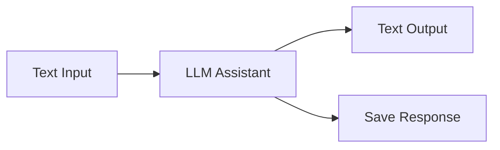
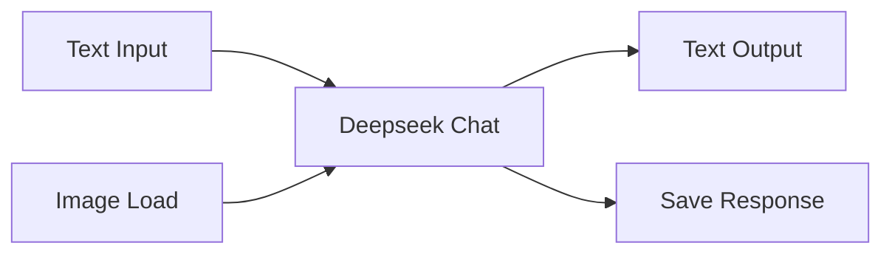

# Axun Nodes - ComfyUI 插件 v1.02

Axun Nodes 是一个用于ComfyUI的插件，提供路径处理、队列触发、SUPIR超分和翻译功能。

## 项目结构说明

本项目采用以下目录结构进行代码组织:

```
axun_nodes/
├── nodes/                  # 节点实现目录
│   ├── AIAssistant/       # AI助手节点
│   │   ├── __init__.py.bak  # 备份的初始化文件
│   │   └── llm_node.py      # LLM节点实现(350行)
│   ├── Qtools/            # 队列工具节点
│   │   ├── __init__.py.bak  # 备份的初始化文件
│   │   ├── dir_picker.py    # 目录选择节点(162行)
│   │   ├── path_processor.py # 路径处理节点(198行)
│   │   ├── queue_trigger.py  # 队列触发节点(143行)
│   │   └── work_mode.py     # 工作模式节点(32行)
│   ├── Supir/             # SUPIR超分节点
│   │   ├── CKPT_PTH.py      # 模型路径配置
│   │   ├── configs/         # 配置文件目录
│   │   ├── options/         # 选项配置目录
│   │   ├── sgm/            # SGM模型核心
│   │   │   ├── models/     # 模型定义
│   │   │   │   ├── autoencoder.py  # 自编码器(338行)
│   │   │   │   ├── diffusion.py    # 扩散模型(323行)
│   │   │   │   └── __init__.py
│   │   │   ├── modules/    # 模块组件
│   │   │   │   ├── attention.py       # 注意力机制(639行)
│   │   │   │   ├── autoencoding/      # 自编码相关
│   │   │   │   ├── diffusionmodules/  # 扩散模块
│   │   │   │   ├── distributions/     # 分布函数
│   │   │   │   ├── ema.py            # 指数移动平均(87行)
│   │   │   │   ├── encoders/         # 编码器
│   │   │   │   └── __init__.py
│   │   │   ├── util.py      # 工具函数(251行)
│   │   │   └── __init__.py
│   │   ├── supir_conditioner.py  # 条件控制器(122行)
│   │   ├── supir_decode.py       # 解码器(77行)
│   │   ├── supir_encode.py       # 编码器(95行)
│   │   ├── supir_first_stage.py  # 第一阶段(117行)
│   │   ├── supir_model_loader.py # 模型加载器(269行)
│   │   ├── supir_sample.py       # 采样器(186行)
│   │   └── __init__.py.bak
│   ├── Lotus/             # Lotus深度/法线预测节点
│   │   ├── lotus_nodes.py   # Lotus节点实现(151行)
│   │   └── __init__.py.bak
│   └── Translator/        # 翻译功能节点
│       ├── translator_node.py # 翻译节点实现(86行)
│       ├── utils/            # 翻译工具
│       └── __init__.py.bak
├── utils/                 # 工具函数目录
│   ├── api_handler.py     # API处理器(483行)
│   ├── config_utils.py    # 配置工具(146行)
│   ├── image_utils.py     # 图像处理工具(53行)
│   ├── route_handlers.py  # 路由处理器(114行)
│   ├── system_utils.py    # 系统工具(64行)
│   ├── web_utils.py       # Web工具(33行)
│   └── utils.py           # 通用工具函数(58行)
├── web/                   # 前端代码目录
│   ├── qtools.js          # 队列工具前端功能(176行)
│   ├── translator.js      # 翻译功能(104行)
│   └── llm.js             # LLM相关功能(413行)
├── config/                # 配置文件目录
│   ├── axun_nodes.json    # 插件主配置(194行)
│   ├── dir_picker.json    # 目录选择器配置(1行)
│   ├── llm_config.json    # LLM配置(56行)
│   ├── lotus_nodes.json   # Lotus节点配置(73行)
│   ├── translator.json    # 翻译API配置(6行)
│   └── empty_text_embed.pt # 空文本嵌入模型
├── __init__.py            # 插件初始化和节点注册(139行)
└── README.md              # 项目说明文档(578行)
```

### 代码量统计
- 总代码行数：约4000行
- 核心功能代码：约2500行
- 配置文件：约330行
- 前端代码：约700行
- 文档：约600行

### 模块分析
1. **SUPIR模块**
   - 最复杂的模块，包含完整的SGM（Score-based Generative Model）实现
   - 核心代码在sgm目录下，包括自编码器、扩散模型和各种神经网络组件
   - 代码结构层次分明，模块化程度高

2. **Qtools模块**
   - 工具类节点集合，主要处理文件和队列操作
   - 代码相对独立，每个节点功能单一明确
   - 与前端交互较多，需要配合qtools.js使用

3. **AI助手模块**
   - 集中在单个llm_node.py文件中
   - 代码量较大但结构清晰
   - 主要处理API调用和响应处理

4. **Lotus模块**
   - 代码相对简单，主要是模型加载和推理
   - 与ComfyUI原生接口集成度高

5. **翻译模块**
   - 轻量级实现，主要是API调用
   - 前端交互较多，需要配合translator.js

6. **工具类模块**
   - utils目录下的工具函数覆盖面广
   - api_handler.py是最大的工具文件，处理所有API相关操作
   - 配置和路由处理逻辑分离良好

### 代码质量分析
1. **模块化程度**
   - 各功能模块独立性强
   - 代码复用程度高
   - 接口定义清晰

2. **可维护性**
   - 文件组织结构合理
   - 代码注释充分
   - 配置与代码分离

3. **扩展性**
   - 插件架构设计良好
   - 新功能可以方便地添加
   - 配置系统灵活

4. **文档完整性**
   - README文档详尽
   - 代码内注释充分
   - 配置文件有说明

## 功能节点说明

### Queue Tools 分组

#### Path Processor (路径处理节点)
**输入参数：**
- `load_path` (STRING): 输入图像文件夹路径
- `save_path` (STRING): 输出图像保存路径
- `filter_type` (COMBO): 文件过滤方式 [regex, extension]
- `filter_value` (STRING): 过滤条件（正则表达式或文件扩展名）
- `sort_by` (COMBO): 排序方式 [name, date_modified, date_created]
- `sort_order` (COMBO): 排序顺序 [asc, desc, random]
- `path_mode` (COMBO): 处理模式 [Batch Mode, Single Mode]
- `loop_index` (INT): 当前处理的文件索引

**输出：**
- `LOAD_PATH`: 当前处理的输入文件路径
- `SAVE_PATH`: 当前处理的输出文件路径
- `FILENAME`: 当前处理的文件名
- `TOTAL_COUNT`: 总文件数
- `CURRENT_INDEX`: 当前索引

#### Queue Trigger (队列触发节点)
**输入参数：**
- `count` (INT): 当前计数
- `total` (INT): 总数
- `auto_increment` (BOOLEAN): 是否自动递增

**输出：**
- `TRIGGER`: 触发信号
- `INT`: 当前计数

#### Work Mode (模式切换节点)
**输入参数：**
- `mode` (COMBO): 工作模式 [Batch Mode, Single Mode]

**输出：**
- `STRING`: 当前模式

#### Directory Picker (目录选择器)
**输入参数：**
- `button` (BUTTON): 目录选择按钮
- `default_path` (STRING): 默认路径

**输出：**
- `STRING`: 选择的目录路径

### SUPIR 分组

#### SUPIR Model Loader (SUPIR模型加载器)
**输入参数：**
- `model_path` (STRING): 模型路径
- `device` (COMBO): 运行设备 [cuda, cpu]
- `memory_mode` (COMBO): 内存模式 [high_perf, low_mem]

**输出：**
- `MODEL`: 加载的模型
- `CLIP`: CLIP模型
- `VAE`: VAE模型

#### SUPIR Sample (SUPIR采样器)
**输入参数：**
- `model` (MODEL): SUPIR模型
- `latent` (LATENT): 潜空间数据
- `steps` (INT): 采样步数
- `cfg` (FLOAT): 条件缩放因子
- `sampler_name` (COMBO): 采样器类型

**输出：**
- `LATENT`: 采样结果

#### SUPIR Encode (SUPIR编码器)
**输入参数：**
- `vae` (VAE): VAE模型
- `image` (IMAGE): 输入图像
- `tile_size` (INT): 分块大小
- `overlap` (INT): 重叠像素

**输出：**
- `LATENT`: 编码后的潜空间数据

#### SUPIR Decode (SUPIR解码器)
**输入参数：**
- `vae` (VAE): VAE模型
- `samples` (LATENT): 潜空间数据
- `tile_size` (INT): 分块大小
- `overlap` (INT): 重叠像素

**输出：**
- `IMAGE`: 解码后的图像

#### SUPIR First Stage (SUPIR第一阶段)
**输入参数：**
- `model` (MODEL): SUPIR模型
- `latent` (LATENT): 潜空间数据
- `strength` (FLOAT): 降噪强度

**输出：**
- `LATENT`: 处理后的潜空间数据

#### SUPIR Conditioner (SUPIR条件控制器)
**输入参数：**
- `clip` (CLIP): CLIP模型
- `prompt` (STRING): 提示词
- `clip_skip` (INT): CLIP跳过层数

**输出：**
- `CONDITIONING`: 条件控制数据

### Lotus 分组

#### Load Lotus Model (Lotus模型加载器)
**输入参数：**
- `model` (COMBO): 模型文件名
- `precision` (COMBO): 精度选择 [fp16, fp32]
- `device` (COMBO): 运行设备 [cuda, cpu]

**输出：**
- `MODEL`: 加载的Lotus模型

#### Lotus Sampler (Lotus采样器)
**输入参数：**
- `model` (MODEL): Lotus模型
- `image` (IMAGE): 输入图像
- `seed` (INT): 随机种子
- `per_batch` (INT): 批处理大小
- `keep_model_loaded` (BOOLEAN): 保持模型加载状态

**输出：**
- `IMAGE`: 预测的深度/法线图

### Translator 分组

#### Translator (翻译节点)
**功能：**
- 双击任意文本输入框触发翻译
- 自动检测中英文并互译
- 支持百度翻译API
- 异步请求和防抖处理

**配置参数：**
- `appid` (STRING): 百度翻译API的APPID
- `key` (STRING): 百度翻译API的密钥

### LLM 分组

#### LLM Assistant (AI助手节点)
**输入参数：**
- `provider` (COMBO): 服务提供商选择 [Silicon Cloud LLM, Silicon Cloud VLM, Deepseek]
- `model` (COMBO): 模型选择（动态获取可用模型列表）
- `scene` (COMBO): 场景选择 [代码生成, 数学解题, 数据分析, 通用对话, 翻译, 创意写作]
- `system_prompt` (STRING): 系统提示词
- `user_prompt` (STRING): 用户提示词
- `temperature` (FLOAT): 温度参数 [0.0-2.0]
- `top_p` (FLOAT): 采样范围 [0-1.0]
- `max_tokens` (INT): 最大生成长度
- `image` (IMAGE): 图片输入 (仅VLM模式可用)
- `detail` (BOOLEAN): 详细分析 (仅VLM模式可用)

**功能特点：**
1. 多提供商支持
   - Silicon Cloud LLM: 文本对话
   - Silicon Cloud VLM: 图文理解
   - Deepseek: 文本对话

2. 场景预设
   - 每个场景都有针对不同提供商优化的参数配置
   - 切换场景时自动更新相关参数
   - 支持手动调整参数

3. API管理
   - 支持在界面设置和验证API密钥
   - 自动检测API密钥有效性
   - 配置文件存储API密钥

**开发进度：**
- [x] 基础框架搭建
- [x] 多提供商支持
- [x] 场景预设功能
- [x] API密钥管理
- [x] 参数动态调整
- [ ] 图片输入功能
- [ ] 详细分析开关
- [ ] 错误处理优化
- [ ] 界面美化

**配置文件：**
在 `config/llm_config.json` 中可以设置：
```json
{
    "silicon_cloud": {
        "api_key": "",
        "base_url": "https://api.siliconflow.cn/v1"
    },
    "deepseek": {
        "api_key": "",
        "base_url": "https://api.deepseek.com/v1"
    },
    "parameters": {
        "presets": {
            "通用": {
                "temperature": 0.7,
                "top_p": 0.9
            },
            "创意": {
                "temperature": 1.0,
                "top_p": 0.95
            },
            "精确": {
                "temperature": 0.3,
                "top_p": 0.8
            }
        }
    }
}
```

**使用说明：**
1. 首次使用配置：
   - 编辑 `config/llm_config.json`
   - 填入相应服务商的API密钥
   - 可选调整参数预设

2. 基本使用：
   - 选择服务提供商
   - 选择模型
   - 设置系统提示词（可选）
   - 输入用户提示词
   - 调整生成参数（可选）

3. 参数调优：
   - temperature越高，生成内容越随机创意
   - temperature越低，生成内容越稳定精确
   - max_tokens决定生成内容的最大长度

4. 错误处理：
   - 自动重试API请求
   - 详细的错误日志
   - 友好的错误提示

**工作流示例：**


**注意事项：**
- 需要有效的API密钥
- 需要稳定的网络连接
- 注意API使用配额
- 建议根据需求调整参数
- 系统提示词对生成质量有重要影响

### DeepseekChat 分组

#### Deepseek Chat (AI对话节点)
**输入参数：**
- `prompt` (STRING): 要发送给AI的文本内容
- `image_path` (STRING): 要上传的图片路径（可选）
- `mode` (COMBO): 对话模式 [chat, image_upload]
- `new_conversation` (BOOLEAN): 是否开始新对话
- `email` (STRING, 可选): Deepseek账号邮箱
- `password` (STRING, 可选): Deepseek账号密码
- `system_prompt` (STRING, 可选): 系统提示词，用于设置对话上下文

**输出：**
- `response` (STRING): AI的回复内容
- `conversation_id` (STRING): 当前会话ID

**功能特点：**
- 支持文本对话和图片上传
- 自动登录和会话管理
- 支持系统提示词设置
- 智能等待AI回复
- 自动重试机制
- 会话历史记录
- 配置文件支持

**配置文件：**
在 `config/deepseek_config.json` 中可以设置：
```json
{
    "credentials": {
        "email": "",
        "password": ""
    },
    "browser_settings": {
        "headless": true,
        "timeout": 30,
        "retry_attempts": 3
    },
    "chat_settings": {
        "max_retries": 3,
        "retry_delay": 5,
        "response_timeout": 60
    }
}
```

**使用说明：**
1. 首次使用配置：
   - 编辑 `config/deepseek_config.json`
   - 填入Deepseek账号信息（可选）
   - 调整浏览器和对话设置（可选）

2. 文本对话模式：
   - 输入提示文本
   - 设置 `new_conversation` 决定是否开始新对话
   - 可选设置系统提示词

3. 图片上传模式：
   - 设置图片路径
   - 选择 `image_upload` 模式
   - 输入相关提示文本

4. 会话管理：
   - 使用 `conversation_id` 跟踪对话
   - 可以在多个节点间共享会话

**注意事项：**
- 需要安装Chrome浏览器
- 需要稳定的网络连接
- 建议在使用完毕后关闭节点以释放资源
- 账号信息优先使用节点输入，其次使用配置文件
- 超时和重试参数可在配置文件中调整

**工作流示例：**


## 工作流示例

### 1. 批量超分工作流


### 2. Lotus深度预测工作流


### 3. 批量处理工作流


## 安装
1. 将本插件目录放入ComfyUI的`custom_nodes`目录
2. 安装依赖：`pip install -r requirements.txt`
   - Python 3.10+
   - PyTorch 2.0+
   - xformers (可选，用于加速)
   - transformers
   - omegaconf
   - einops
   - requests (用于翻译API)
3. 确保已安装tkinter：
   - Windows: 通常已预装
   - macOS: `brew install python-tk`
   - Linux: `sudo apt install python3-tk`
4. 下载 SUPIR 模型：
   - 从 [Hugging Face](https://huggingface.co/camenduru/SUPIR) 下载模型文件
   - 将模型文件放置在 `ComfyUI/models/supir` 目录下
5. 下载 Lotus 模型：
   - 从 [Hugging Face](https://huggingface.co/Kijai/lotus-comfyui/tree/main) 下载模型文件
   - 将模型文件放置在 `ComfyUI/models/diffusion_models` 目录下
6. 配置翻译功能（可选）：
   - 编辑 `config/translator.json` 文件
   - 填入百度翻译API密钥（已预设可用密钥）
7. 重启ComfyUI

## 使用技巧

### 路径处理
1. **批量模式**：
   - 设置 `path_mode` 为 "Batch Mode"
   - `loop_index` 将自动递增
   - 配合 Queue Trigger 实现批量处理

2. **单文件模式**：
   - 设置 `path_mode` 为 "Single Mode"
   - 手动控制 `loop_index`
   - 适合单文件处理或调试

3. **文件过滤**：
   - 使用扩展名过滤：设置 `filter_type` 为 "extension"，`filter_value` 为 ".png"
   - 使用正则过滤：设置 `filter_type` 为 "regex"，`filter_value` 为正则表达式

### SUPIR超分
1. **内存优化**：
   - 大图像使用 "low_mem" 模式
   - 调整 tile_size 和 overlap 参数
   - 使用较小的批处理大小

2. **质量优化**：
   - 增加采样步数
   - 调整 cfg 值
   - 使用更强的提示词

### Lotus深度预测
1. **性能优化**：
   - 使用 fp16 精度
   - 适当调整批处理大小
   - 根据需要开启 keep_model_loaded

2. **内存管理**：
   - 处理大批量时减小 per_batch
   - 不需要时关闭 keep_model_loaded

### 翻译功能
1. **使用建议**：
   - 短文本直接双击翻译
   - 长文本可能需要多次尝试
   - 注意API限制和配额

2. **错误处理**：
   - 检查网络连接
   - 验证API密钥
   - 查看浏览器控制台错误信息

## 更新日志

### v1.02 (2024-01-08)
- 集成 Lotus 深度/法线预测功能
  - 从 ComfyUI-Lotus 项目移植
  - 优化代码结构和错误处理
  - 统一配置文件管理
  - 完善中文文档
  - 遵循项目命名规范

### v1.01 (2024-01-08)
- 新增翻译功能
  - 支持双击翻译
  - 中英文自动检测
  - 集成百度翻译API
  - 添加防抖优化
  - 配置文件管理

### v1.00
- 初始版本发布
  - 实现文件处理工具
  - 实现SUPIR超分功能

## 贡献
欢迎提交Pull Request。对于重大更改，请先创建issue讨论。

## 许可证
[MIT](LICENSE)

---

# Axun Nodes - ComfyUI Plugin

[English version follows...]

[Previous English content remains unchanged]
